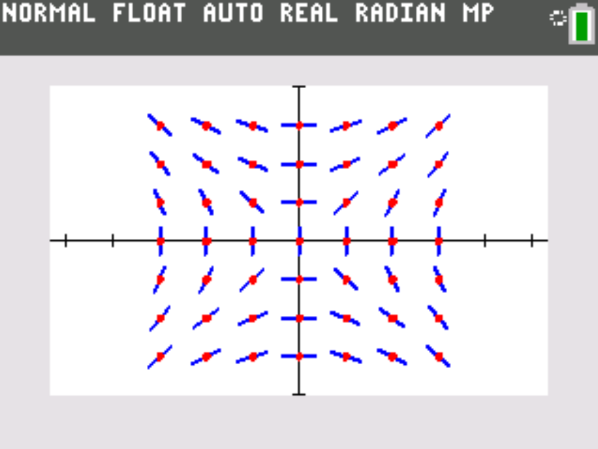
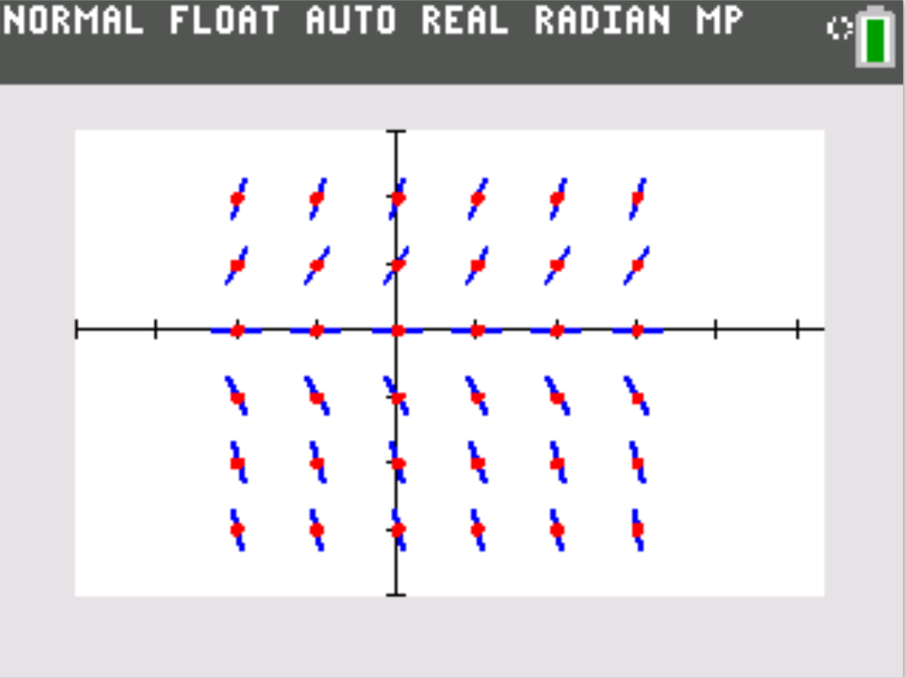
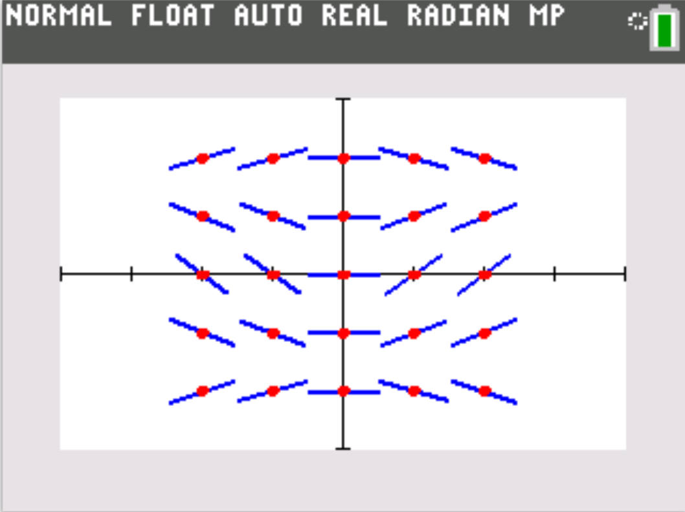

# slope-field-TI84
## Graphs slope fields on the TI-84 used to solve Differential Equations.

### Disclaimer:  
### You must have the TI-Connect CE software installed on your computer in order to edit, view, and install the code onto your calculator.

## Examples:  

## $\frac{dy}{dx}=\frac{x}{y}$, Length of lines = 0.75, From (-3, -3) to (3, 3)  

## $\frac{dy}{dx}=2xy$, Length of lines = 0.60, From (-2, -3) to (3, 2)  

## $\frac{dy}{dx}=sin(x)cos(y)$, Length of lines = 1, From (-2, -2) to (2, 2)  

